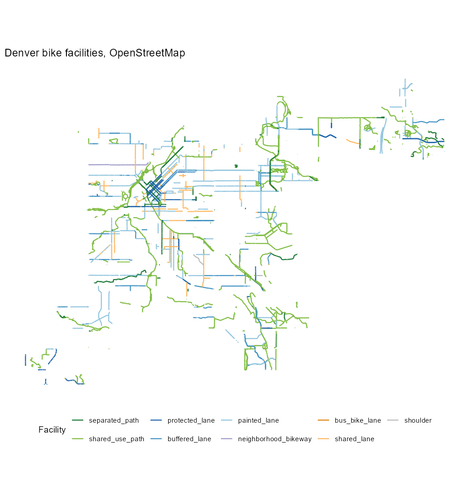
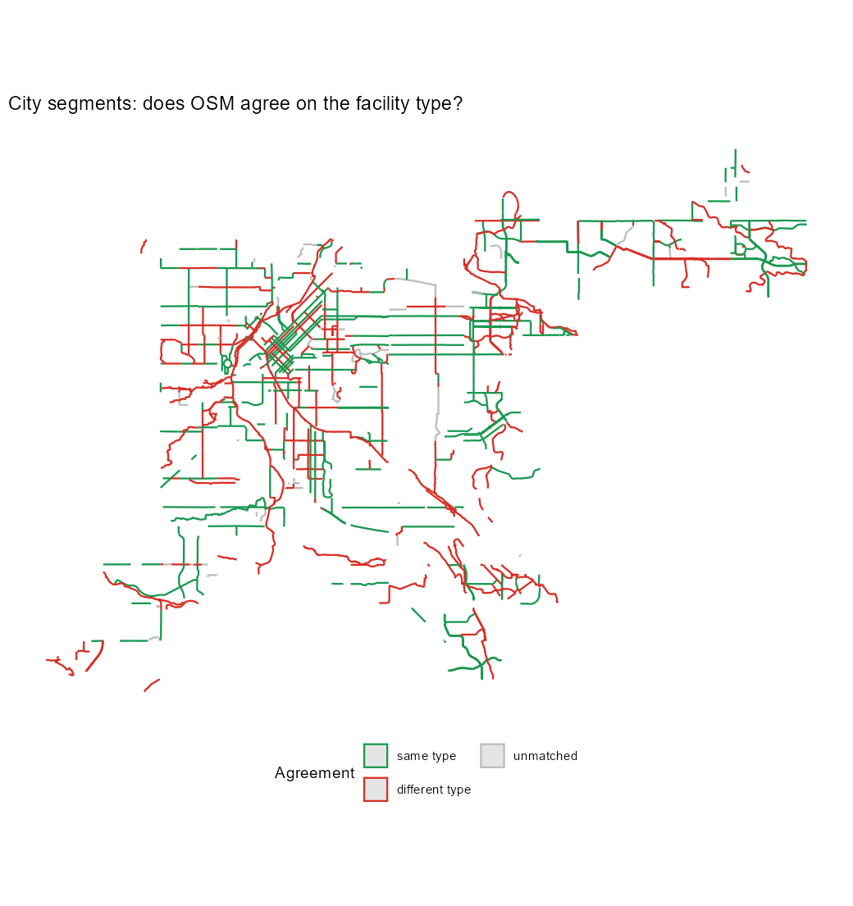

# cyclelanes

Bicycle infrastructure for any place, as a tidy `sf` object.

`cyclelanes` pulls every bicycle-related way for a place from
OpenStreetMap, normalises the dozen-odd OSM tagging conventions into one
facility taxonomy with a per-side classification, and can run a city's
official bike-facility inventory through the same taxonomy so the two can
be summarised and compared. Denver, Colorado is the built-in worked
example; Austin, Boulder and Seattle are registered too, and other
cities plug in through a source registry.

There is no Google Maps source, and there will not be one: Google exposes
no bike-lane data endpoint and its terms forbid scraping the map layer.
OpenStreetMap is where that data actually lives.

Documentation and a worked Denver example:
<https://mjorden.github.io/cyclelanes/>.

## Install

```r
# install.packages("remotes")
remotes::install_github("mjorden/cyclelanes")
```

`sf` and `osmdata` are the heavy dependencies; both ship CRAN binaries for
Windows and macOS. `ggplot2` is optional, for `cl_plot()`.

## Quick start

```r
library(cyclelanes)

# 1. OpenStreetMap, any place name or bounding box. A place name is
#    clipped to its administrative boundary, so this is Denver proper,
#    not the bounding box that spills into Lakewood and Aurora.
#    backend = "extract" reads a Geofabrik extract instead of querying
#    Overpass, which is the right choice for a whole city.
denver <- cl_bike_lanes("Denver, Colorado", backend = "extract", cache = TRUE)
cl_summary(denver)
#>          facility_type n_segments length_km length_mi share
#> 1       separated_path        637      47.3      29.4 0.074
#> 2      shared_use_path       2249     261.3     162.4 0.407
#> 3       protected_lane        489      51.2      31.8 0.080
#> 4        buffered_lane        408      60.0      37.3 0.093
#> 5         painted_lane       1261     167.3     104.0 0.261
#> 6 neighborhood_bikeway         27       4.7       2.9 0.007
#> ...

cl_plot(denver, title = "Denver bike facilities, OpenStreetMap")
```



```r
# 2. The city's own inventory, through the same taxonomy, cut to the same
#    boundary so the two layers cover the same ground
official <- cl_fetch_official("denver", bbox = attr(denver, "cl_boundary"))
cl_summary(official, by = c("facility_type", "status"))

# 3. How well do they agree?
cmp <- cl_compare(denver, official, tolerance = 15)
cmp
#> <cl_comparison> tolerance = 15 m
#>
#>    layer n_segments length_km matched_km matched_frac type_agreement type_adjacent
#>      osm       5407     641.8      501.1        0.781          0.552         0.869
#> official        811     615.6      472.0        0.767          0.570         0.900

cl_plot(cmp$official, colour = "type_match",
        title = "City segments: does OSM agree on the facility type?")
```



Both sources agree that *something* is there for about 78% of each
other's length. They agree on *what* for 55% of it, or 87% once adjacent
levels (painted versus buffered lane) are allowed. The two conventions
gaps the confusion matrix exposes are off-street, where the city files
169 km as "Trail" and OSM tags most of it `path` + `bicycle=designated`
(a `shared_use_path` here), and neighborhood bikeways, of which the city
has 62 km and OSM 5 km.

```r
# Official facilities that OSM does not know about
missing <- dplyr::filter(cmp$official, matched_frac < 0.5)
cl_plot(missing)

# 4. How comfortable is it to ride? Level of Traffic Stress, 1 to 4, from
#    the facility type and the parent road's speed limit and lane count
stress <- cl_lts(denver)
cl_summary(stress, by = "lts")
cl_plot(stress, colour = "lts")
```

To see how a network has grown, `cl_timeline()` fetches the same place as
it was on each of a series of dates through Overpass's attic data and
stacks the summaries:

```r
growth <- cl_timeline("Boulder, Colorado", dates = paste0(2014:2026, "-01-01"))
```

Whether those comfortable facilities connect to each other is the next
question. `cl_components()` keeps the segments at or below a stress level,
snaps them into an `sfnetworks` graph, and labels each with its connected
component, largest first; `cl_map()` puts any of these layers on an
interactive `leaflet` map with a link from each segment to its way on
openstreetmap.org, so a mapper can fix a tag from the map.

```r
low <- cl_components(stress, max_lts = 2)
head(attr(low, "components"))       # the low-stress islands, largest first
cl_plot(low, colour = "component")
cl_map(cmp)                          # both layers, with the gaps highlighted
```

`cl_lts()` follows the Mekuria, Furth and Nixon (2012) criteria as
simplified in Furth's 2017 tables, on segments only (no intersection
approaches or parking conflicts). Where a road has no `maxspeed` or
`lanes` tag its class stands in, and `lts_basis` says so, so scores built
on assumptions can be told from scores built on tags. The rule table is
`inst/extdata/lts_rules.csv`.

A bounding box works anywhere in the world and is the fastest way to
iterate:

```r
lodo <- cl_bike_lanes(c(-105.005, 39.740, -104.985, 39.752))
```

To try the package with no network at all, the same downtown box ships
frozen as `denver_lodo`: raw OSM ways plus the city's segments, fetched
2026-09-03.

```r
lanes <- cl_classify(denver_lodo$osm, drop_none = TRUE)
cl_compare(lanes, denver_lodo$official)
```

## Crashes

The same registry pattern reads a city's reported crashes, so the two
halves of the safety story sit in one frame:

```r
crashes <- cl_fetch_crashes("denver", years = 2019:2025)   # bicycle-involved by default
cl_summary(crashes, by = "severity")
```

Denver's police layer is built in; other cities register with
`cl_register_crash_source()`. `cl_crash_join()` snaps each crash to the
nearest facility and `cl_crash_rates()` reports reported crashes per
**kilometre-year** by facility type, intersection and mid-block on
separate rows, because intersection crashes attach to whichever facility
passes through:

```r
j <- cl_crash_join(official, crashes, tolerance = 25)
cl_crash_rates(j, years = 2019:2025)
cl_plot(official, crashes = crashes)
```

Per kilometre-year is not per rider: a busy protected lane carries many
times the riders of a quiet sharrow. Give the facilities an `exposure`
column (daily bicycle volume) and the rates also come per million
bicycle-kilometres. Police data miss about half of bicycle
injury crashes and nearly all crashes without a motor vehicle, so these
are *reported* crashes, and the layer is revised continuously, so the
fetch time travels with the result.

## The taxonomy

Every facility from either source lands in one of these levels, ordered
from most to least physically separated from motor traffic:

| level | meaning | typical OSM tagging |
|---|---|---|
| `separated_path` | dedicated off-street cycleway or trail | `highway=cycleway` |
| `shared_use_path` | off-street path shared with pedestrians | `highway=path/footway` + `bicycle=designated`; `highway=cycleway` + `segregated=no` |
| `protected_lane` | on-street, physically separated | `cycleway=track` |
| `buffered_lane` | painted lane with painted buffer | `cycleway=lane` + `cycleway:buffer=*` |
| `painted_lane` | painted lane | `cycleway=lane` |
| `neighborhood_bikeway` | low-traffic street designated for bikes | `bicycle_road=yes`, `cyclestreet=yes` |
| `bus_bike_lane` | shared bus and bike lane | `cycleway=share_busway` |
| `shared_lane` | sharrows | `cycleway=shared_lane` |
| `shoulder` | rideable paved shoulder | `cycleway=shoulder` |
| `none` | no facility | `cycleway=no`, absent, unrecognised |

For OSM, `cl_classify()` resolves `cycleway`, `cycleway:both`,
`cycleway:left` and `cycleway:right` into a `facility_left` and a
`facility_right`, upgrades painted lanes with a buffer tag, flags
contraflow lanes, and reports the more protected side as `facility_type`.
`cycleway=separate` (the lane is mapped as its own way) yields `none` so
nothing is counted twice; the separately drawn way itself, when tagged
`is_sidepath=yes` or `cycleway=track`, is a `protected_lane` with
`mapped_separately = TRUE` rather than a trail. Sidewalks (`footway=sidewalk`) are never
facilities, whatever their `bicycle` tag, and `strict = TRUE` additionally
drops shared-use paths with no paved surface tag, which removes most of
the park footways that mappers mark bike-friendly.

## Adding a city

`cl_sources()` lists what is registered. To add one, first look at the
candidate layer: `cl_inspect_source()` prints its fields, the distinct
values of every short text field, and where its extent sits, so you can
spot the class field and confirm the layer is actually the city you think
it is (the first search hit for "Denver bicycle facilities" is an Austin
layer).

```r
cl_inspect_source("https://.../FeatureServer/0")
```

Then supply the layer, the attribute that holds the facility class, and a
crosswalk from that attribute's values into the taxonomy:

```r
cl_register_source(
  "portland",
  type = "arcgis",
  url = "https://.../FeatureServer/0",
  class_field = "Facility",
  crosswalk = c(
    "Protected Bike Lane" = "protected_lane",
    "Buffered Bike Lane"  = "buffered_lane",
    "Bike Lane"           = "painted_lane",
    "Neighborhood Greenway" = "neighborhood_bikeway",
    "Multi-Use Path"      = "separated_path"
  ),
  existing_where = "Status = 'Active'",
  attribution = "City of Portland Open Data"
)
cl_fetch_official("portland")
```

`type = "arcgis"` pages through any ArcGIS REST layer as GeoJSON.
`type = "file"` hands the location to `sf::st_read()`, so a GeoJSON URL, a
zipped shapefile, or a local GeoPackage all work. Class values missing
from the crosswalk are mapped to `none` with a warning naming them and
how many kilometres they carry, so a stale crosswalk is loud rather than
silent; `cl_check_source("denver")` compares a crosswalk with the live
class values on demand, and a weekly workflow does the same for every
built-in source and opens an issue when a city adds a class. Pull requests adding cities to
the built-in registry are welcome.

## Caveats

- **OSM completeness varies.** Trails and protected lanes tend to be
  mapped well; neighborhood bikeways and shared streets, which have little
  physical presence, are often missing. `cl_compare()` exists to make
  that visible.
- **The Denver source is the 2025 Denver Moves: Bikes inventory**, which
  carries both existing and future bikeways. `existing_only = TRUE` (the
  default) keeps segments with an existing facility type; the proposed
  type is still available in the `proposed_class` column.
- **Type agreement is length-weighted and spatial.** `cl_compare()`
  assigns each segment the other layer's type that covers most of it
  within the tolerance. Where two facilities run side by side (a trail
  beside a painted lane) the nearer one wins, and adjacent levels such as
  painted vs buffered lane are reported separately because that
  distinction is often a tagging choice.
- **Overpass and Nominatim are shared public services.** A whole metro
  area is fine; a state is not. Respect the Nominatim usage policy for
  geocoding. The public Overpass instance answers `HTTP 429` when one
  address queries too often and `504` when it is busy; `cl_fetch_osm()`
  retries those with backoff, and you can use a mirror for one call and
  cache the result so a re-run never touches the server:

  ```r
  denver <- cl_bike_lanes("Denver, Colorado", cache = TRUE,
                          overpass_url = "https://overpass.private.coffee/api/interpreter")
  ```

  Cached results live in `cl_cache_dir()` for 30 days by default;
  `cl_cache_clear()` empties it. For a whole city, or several, skip
  Overpass entirely: `backend = "extract"` downloads the Geofabrik
  extract for the region through `osmextract`, converts it once, and
  reads the ways locally. The first download of a state is large and the
  conversion takes minutes; after that every city in the region is
  instant and offline.

  ```r
  denver <- cl_bike_lanes("Denver, Colorado", backend = "extract")
  ```
- **Official data is licensed by each city.** The Denver layer is
  published under the Denver Open Data terms; `cl_sources()` carries the
  attribution string to reproduce.

## Development

```r
devtools::test()      # offline suite
```

The tests that talk to Overpass, Nominatim, and the Denver ArcGIS service
are opt-in so CI never fails on a shared server's rate limit:

```r
withr::with_envvar(c(CYCLELANES_LIVE_TESTS = "true"), devtools::test())
```

## License

MIT. OpenStreetMap data is © OpenStreetMap contributors, ODbL.
